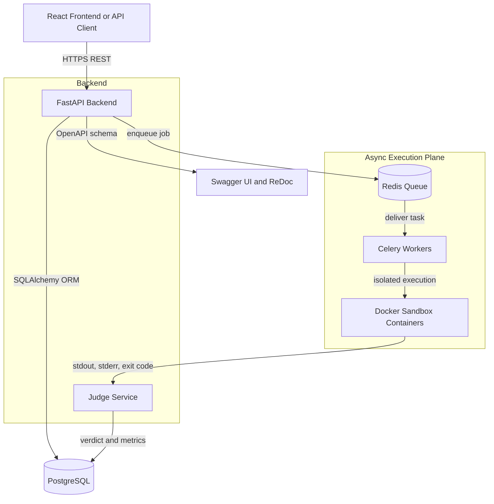
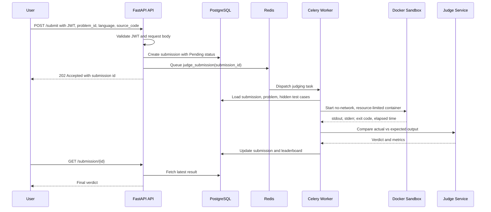
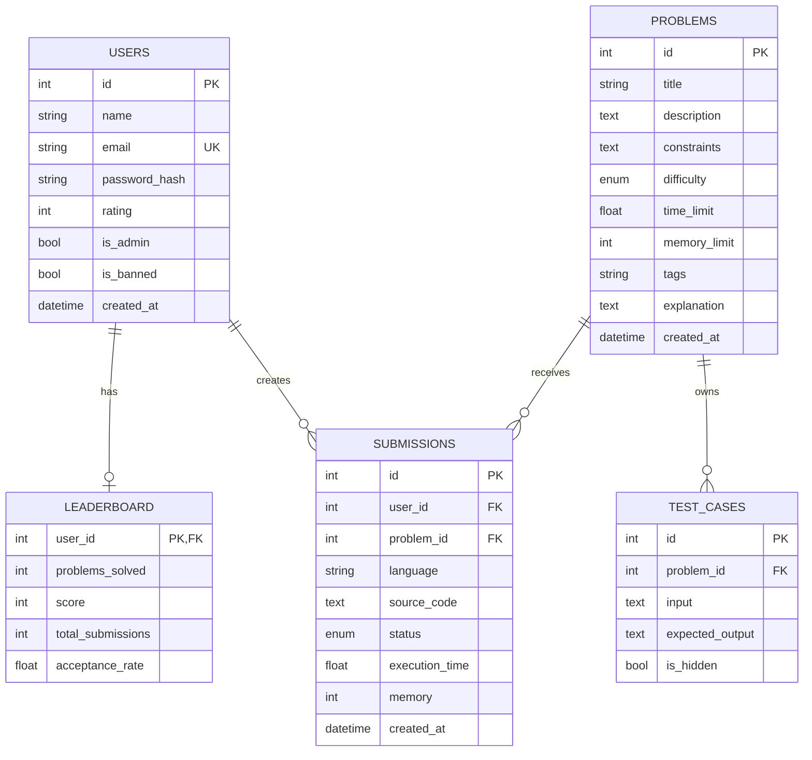

# PyJudge

PyJudge is a secure online code execution platform built from the SRS for coding assessments. It exposes a FastAPI backend for authentication, problem management, sample runs, submissions, judging, history, leaderboard, and admin monitoring.

## Tech Stack

Python • FastAPI • PostgreSQL • SQLAlchemy • Redis • Celery • Docker • JWT • Pytest

## System Design

### High-Level Architecture



PyJudge separates request handling from code execution. The FastAPI service handles authentication, problem metadata, submissions, and read APIs. Celery workers consume queued judging jobs and run untrusted code inside short-lived Docker containers. PostgreSQL stores users, problems, test cases, submissions, and leaderboard data. Redis acts as the broker between the API and worker tier.

### Submission Sequence



### Database ER Diagram



### Folder Structure

```text
backend/
  app/
    api/          FastAPI routers for auth, problems, submissions, users, admin
    auth/         JWT creation/verification and password hashing
    config/       environment settings, database engine, session dependency
    models/       SQLAlchemy entities and enums
    schemas/      Pydantic request and response models
    services/     judging, execution, and leaderboard update logic
    workers/      Celery app and background judging task
    docker/       reserved for future sandbox images/profiles
    judge/        reserved for future judge-specific extensions
    utils/        reserved for shared helpers
  tests/          pytest unit and integration tests
  Dockerfile
  requirements.txt
docs/
  api.md          endpoint-level API documentation
  deployment.md   Compose deployment, scaling, and production checklist
frontend/         React client application codebase
docker-compose.yml
.env.example
pytest.ini
```

### API Flow

```mermaid
flowchart LR
    Auth[Auth APIs\n/signup /login /refresh] --> Token[JWT Access Token]
    Token --> Problems[Problem APIs\n/problems /problem/{id}]
    Token --> Run[Run API\n/run sample tests]
    Token --> Submit[Submit API\n/submit hidden tests]
    Submit --> History[Submission APIs\n/submission/{id} /history]
    Submit --> Board[Leaderboard\n/leaderboard]
    Admin[Admin JWT] --> Manage[Admin APIs\n/problem /testcases /dashboard /ban]
```

Typical candidate flow: sign up or log in, browse problems, fetch samples, run code against public tests, submit for hidden tests, then poll submission history or leaderboard. Typical admin flow: log in with admin privileges, create problems, add public and hidden tests, monitor dashboard counts, and ban abusive users.

### Security Decisions

- **Docker for untrusted code isolation:** User code is executed outside the API process in short-lived containers. The Docker path disables networking, mounts the workspace read-only, applies CPU and memory limits, sets a process limit, and destroys the container after execution.
- **Celery for async execution:** Code judging can be slow or adversarial. Celery keeps API requests fast by moving execution into background workers, preventing long-running submissions from blocking web workers.
- **Redis as broker:** Redis provides a simple, fast queue for dispatching submission jobs from FastAPI to Celery workers. It also allows the worker pool to scale independently from the API tier.
- **JWT and bcrypt for authentication:** Passwords are stored as bcrypt hashes. JWT access tokens protect user, submission, and admin routes without requiring server-side session state.
- **Hidden test cases:** Public samples are returned to candidates, while hidden tests stay server-side and are only loaded by the judging worker during submission evaluation.
- **Worker isolation:** The API container does not need to execute user code directly. In production, workers should run on isolated hosts with restricted Docker socket access, rootless Docker where possible, and hardened seccomp/AppArmor profiles.
- **Local fallback mode:** Local development can run Python with an inline executor and in-memory tests, but production should enable `EXECUTOR_USE_DOCKER=true` and run submissions through Celery workers.
## Implemented Functionality

- JWT-based signup, login, refresh, and profile authentication.
- Password hashing with bcrypt.
- Problem listing, details, sample test cases, and admin CRUD.
- Public and hidden test case storage.
- `/run` for sample tests without storing solved state.
- `/submit` with persisted submissions and async Celery dispatch.
- Inline judging fallback when Celery is not installed or unavailable.
- Python execution with local dev mode and Docker sandbox mode.
- Verdicts for Accepted, Wrong Answer, Runtime Error, TLE, Presentation Error, and unsupported-language Compilation Error.
- Submission history, leaderboard calculation, admin dashboard, submission listing, and user ban endpoint.
- Docker Compose stack for API, worker, PostgreSQL, and Redis.
- Unit and integration tests for the main API flows.

## Performance

- **21 REST APIs**
- **146.6 req/s**
- **282 ms average latency**
- **Docker sandbox execution**
- **84% backend test coverage**

Supports asynchronous code evaluation using Celery workers and can be horizontally scaled by increasing worker instances.

## Local Development

```powershell
cd backend
python -m venv .venv
.venv\Scripts\activate
pip install -r requirements.txt
uvicorn app.main:app --reload
```

The default `DATABASE_URL` points to a SQLite database in your OS temp directory. Override it for PostgreSQL or a custom SQLite location.

Useful URLs:

- API: http://127.0.0.1:8000
- Swagger UI: http://127.0.0.1:8000/docs
- ReDoc: http://127.0.0.1:8000/redoc
- Health check: http://127.0.0.1:8000/health

## Docker Compose

Copy the sample environment and edit secrets before running:

```powershell
Copy-Item .env.example .env
docker compose --env-file .env up --build
```

Services:

- `api`: FastAPI app on port `8000`.
- `worker`: Celery worker that runs judging jobs.
- `db`: PostgreSQL 16.
- `redis`: Redis broker/result backend.

## Testing & Code Coverage

PyJudge includes automated unit and integration tests covering user authentication, problem CRUD, and submission runs.

### Running Tests
Execute the tests locally:
```powershell
pip install -r backend/requirements.txt
pytest
```
*Note: The test suite uses an in-memory SQLite database and local Python execution. It does not require active Docker, Redis, or PostgreSQL instances.*

### Test Coverage Results
Our automated test suite runs **10 test cases** achieving **84% overall statement coverage** (592 Statements, 94 Missed) across core app routes and logic.

| Module / Component | Statements | Misses | Coverage % |
| :--- | :---: | :---: | :---: |
| `app/main.py` | 20 | 1 | 95% |
| `app/api/admin.py` | 20 | 2 | 90% |
| `app/api/auth.py` | 33 | 2 | 94% |
| `app/api/problems.py` | 56 | 25 | 55% |
| `app/api/submissions.py` | 61 | 11 | 82% |
| `app/api/users.py` | 14 | 0 | 100% |
| `app/auth/security.py` | 42 | 4 | 90% |
| `app/config/database.py` | 26 | 2 | 92% |
| `app/config/settings.py` | 19 | 0 | 100% |
| `app/models/entities.py` | 74 | 0 | 100% |
| `app/services/executor.py` | 75 | 17 | 77% |
| `app/services/judge.py` | 22 | 1 | 95% |
| **Total** | **592** | **94** | **84%** |

## API Documentation

FastAPI generates OpenAPI automatically at `/openapi.json`. Human-readable API details are in [docs/api.md](docs/api.md).

## Deployment

Deployment guidance for Compose, environment variables, sandbox hardening, and production checks is in [docs/deployment.md](docs/deployment.md).

## Security Notes

The Docker executor disables networking, mounts source read-only, sets CPU and memory limits, and applies a process limit. For production use, run workers on isolated hosts, prefer rootless Docker, add seccomp/AppArmor policies, enforce rate limiting at the edge, and rotate `SECRET_KEY` through a secret manager.